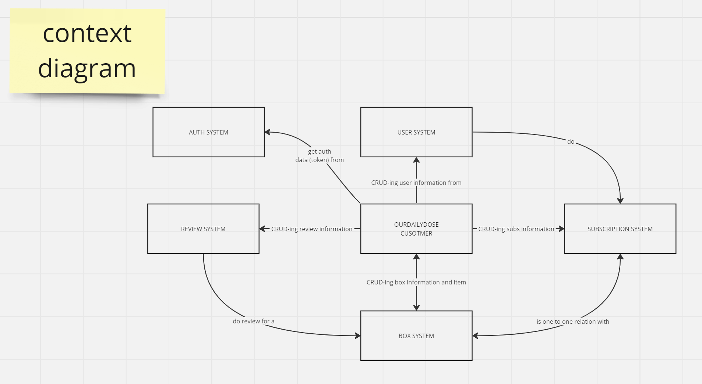
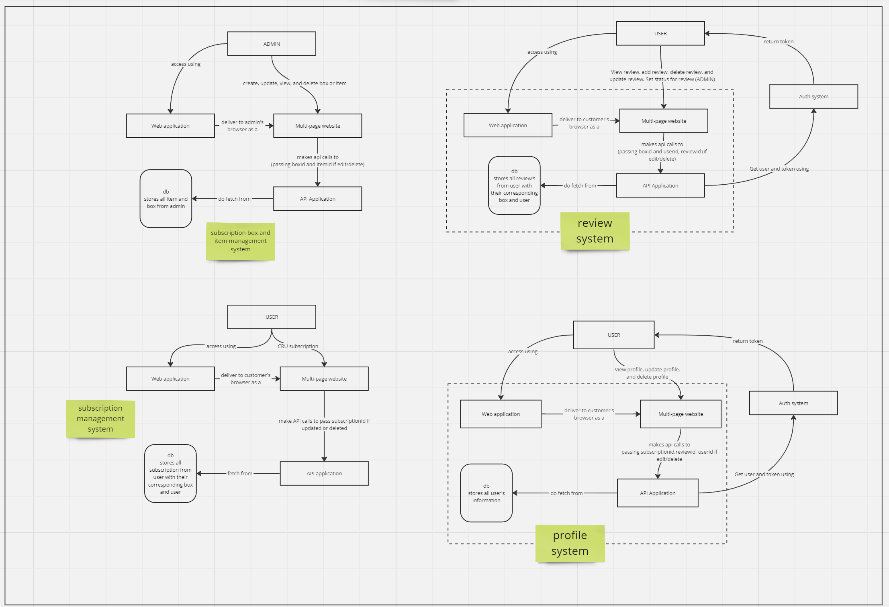

## Context Diagram

 

## Container Diagram

 

## Deployment diagram

 
https://drive.google.com/file/d/1xd5uG2SD0TZvW2bkgvlB6ThqQ5vf1G3f/view?usp=sharing

Pada proyek TK ini, kami mengimplementasikan arsitektur berbasis MICROSERVICE (yang dikelola mengunakan API gateway), kami memilih arsitektur tersebut karena:
- Skalabilitas yang berjalan secara independen
- Dapat mengontrol sumber daya (fokus pada service yang sering digunakan tanpa menambah jumlah service yang relatif jarang digunakan)
- CI/ID tidak mengganggu progress anggota lain (mengurangi risiko kegagalan total)
- Pemisahan tanggung jawab (SRP)
- Pengelolaan data yang terpisah

Untuk ke depannya, kami berencana mengimplementasikan event-driven-architecture yang memungkan sistem jauh lebih flesibel dan meningkatkan daya skalabilitas, hal ini dilakukan karena semakin kompleks suatu microservice dalam pengembangan ke depannya, rawan terjadi kerusakan pada suatu bagian microservice sehingga hal ini dapat memengaruhi performa microservice lainnya yang saling berinteraksi. Terlebih lagi, repository kami telah dirancang hampir 1 repo untuk 1 orang (ada pengecualian sedikit) sehingga setiap orang mengerjakan bagiannya tanpa dipantau secara langsung oleh rekan lainnya, seperti cara kodingannya dan alur pengerjaannya sehingga rawan terjadi miss pada hal ini.

Analisis risiko penting dalam perancangan arsitektur karena dapat membantu mengidentifikasi potensi masalah yang mungkin terjadi saat memodifikasi sistem yang sudah ada. Salah satu risiko utama adalah dampak terhadap kinerja dan stabilitas sistem, karena modifikasi arsitektur bisa memperkenalkan bottleneck atau kompleksitas yang meningkat. Namun, modifikasi tersebut bisa dibenarkan dengan alasan untuk meningkatkan skalabilitas, toleransi kesalahan, dan keamanan sistem. 

Dengan mendesain ulang arsitektur agar lebih modular dan dapat diskalakan, sistem dapat menangani peningkatan beban pengguna atau kebutuhan bisnis yang berkembang. Ini juga memungkinkan sistem untuk lebih tangguh terhadap kegagalan dan lebih siap untuk mempertahankan operasi bahkan di hadapan kejadian tak terduga. 

Selain itu, modifikasi arsitektur dapat memperkuat keamanan sistem dengan menerapkan langkah-langkah keamanan yang kuat, seperti enkripsi dan kontrol akses, serta memfasilitasi kepatuhan dengan peraturan atau standar industri. Ini semua menyoroti pentingnya menganalisis risiko dengan cermat dan mengimplementasikan modifikasi arsitektur yang sesuai untuk mengatasi tantangan yang ada sambil tetap mempertahankan tujuan jangka panjang sistem.
